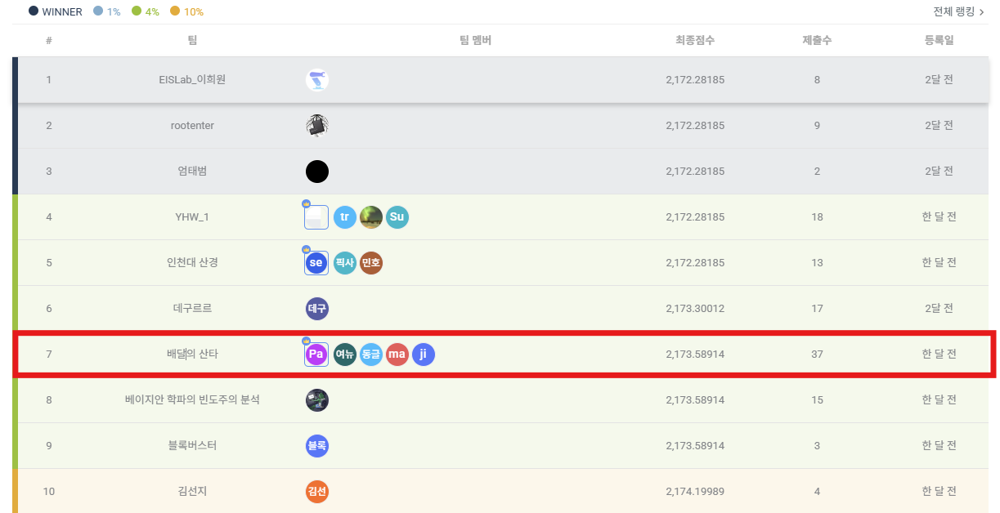

  

## 프로젝트 요약 [**(PDF 보기)**](./데이콘_선물_선물_배송경로_최적화_경진대회.pdf)
프로젝트는 **LKH-3 최적화 알고리즘과 4-opt 기법**을 활용하여 **산타의 선물 배송 경로 최적화 문제를 해결**하는 것을 목표로 진행되었습니다. 경로 최적화를 위한 다양한 알고리즘을 적용하고 비교하며 **효율적인 배달 경로를 탐색**하고자 했습니다.

---

## ✅진행 배경 
- **대회 목표**: 크리스마스 선물 배송을 위한 최적의 배달 경로를 찾아 배달 시간을 단축하고 비용을 최소화.
- **접근 방식**:
  - LKH-3 기반의 **탐색 알고리즘 활용**
  - **유클리드 거리 계산을 기반으로 VRP 문제를 모델링**
  - 4-opt **로컬 최적화 기법 적용**
- **주요 고려 요소**:
  - 배달 차량의 **적재 한도** (CAPACITY 제한)
  - 출발 및 도착 위치(DEPOT) 고려
  - **최적의 코스트 최소화** 및 실행 시간 단축

---

## 📊성과 및 결과  
- **최종 결과**:  
  - **LKH-3 Version 3.0.13** 및 **4-opt 기법**을 활용하여 **최적 경로 탐색**  
  - **최종 점수: 2,173.58914**  
  - **Dacon 리더보드에서 7위 달성**  

🔗 [대회 리더보드 바로가기](https://dacon.io/competitions/official/236437/leaderboard)

  

---
 
## 🛠사용 언어와 라이브러리 
- **프로그래밍 언어**: Python  
- **사용된 주요 라이브러리 및 툴**: pandas, NumPy, subprocess, LKH-3, 4-opt 알고리즘 등

---

## 📌 프로젝트 진행 과정  
1. **데이터 탐색 및 문제 정의**  
   - VRP 문제 분석 및 제약 조건 정리  
   - CSV 데이터(`data.csv`) 정리 및 좌표 변환  

2. **초기 시도한 경로 최적화 방법 및 시행착오**  
   - 최적의 경로를 찾기 위해 다양한 알고리즘을 실험하였음  
   - **유전 알고리즘 (GA, Genetic Algorithm)** → **랜덤성으로 인해 일정한 품질의 해를 도출하기 어려움**  
   - **담금질 기법 (SA, Simulated Annealing)** → **탐색 속도가 느리고, 해 품질이 불안정함**  
   - **개미 군집 최적화 (ACO, Ant Colony Optimization)** → **수렴 속도가 느려 대규모 문제에서 실용성이 떨어짐**  
   - **타부 서치 (Tabu Search)** → **지역 최적해(Local Optima) 문제 발생**  
   - **Gurobi** → **최적해를 찾지만 연산 시간이 너무 오래 걸림**
   
   🔍 **결론**:  
   - 기존 방법들은 **최적해를 찾는 데 시간이 오래 걸리거나**, **탐색 과정에서 지역 최적해에 빠지는 문제**가 발생  
   - **LKH-3는 VRP(차량 경로 최적화) 문제에 특화된 알고리즘으로, 속도와 해 품질의 균형이 우수**  
   - 추가적으로 **4-opt를 적용하여 로컬 최적화를 수행함으로써 경로의 품질을 더욱 개선**  

3. **LKH-3 알고리즘 적용**  
   - `.tsp` 파일 및 `.par` 파일 생성  
   - `LKH-3.exe` 실행 후 솔루션 파일 분석  

4. **4-opt 기반 경로 최적화**  
   - LKH-3가 찾은 초기 솔루션을 기반으로 **로컬 최적화 수행**  
   - 차량 적재 한도를 고려한 경로 수정  

5. **최적화 결과 평가 및 제출 파일 생성**  
   - `submission.csv` 생성 및 최적 경로 저장  
   - 최종 코스트 비교 및 리더보드 업로드  

---

## 💻 학습 및 성장  
- **🚀 기술적 성장**:  
  - **LKH-3 알고리즘 활용 능력 강화**: 직접 `.tsp` 및 `.par` 파일을 생성하고 실행하는 과정을 통해 **탐색 기반 최적화 알고리즘에 대한 이해도 증가**  
  - VRP(차량 경로 최적화) 문제에 대한 이해 심화  
  - **병렬 연산 (joblib) 활용** → LKH-3 실행을 병렬화하여 실행 속도를 개선하는 과정에서 **병렬 프로그래밍의 중요성을 배움**  

- **🤝 팀워크 및 협업**:  
  - 대회 진행 중 팀원들과의 **역할 분담을 통해 최적화 전략을 개선**  
  - 코드 리뷰 및 최적화 아이디어 공유 과정에서 **의사소통 능력 향상**  

- **🔍 문제 해결 능력**:  
  - LKH-3를 단순 실행하는 것에서 그치지 않고, **초기해 개선을 위해 여러 알고리즘을 실험한 경험**  
  - VRP 문제의 현실적인 제약 조건을 반영하면서도 **탐색 알고리즘을 조정하는 과정에서 알고리즘 설계 및 튜닝 역량 향상**  

